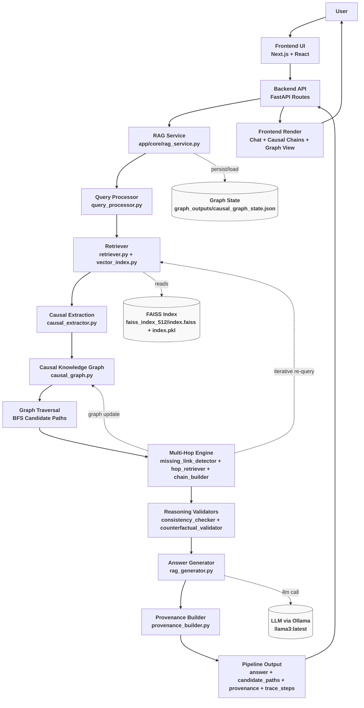

# System Pipeline Diagram

```mermaid
flowchart TD
    U[User]
    FE[Frontend UI\nNext.js + React]
    API[Backend API\nFastAPI Routes]
    SVC[RAG Service\napp/core/rag_service.py]

    QP[Query Processor\nquery_processor.py]
    RET[Retriever\nretriever.py + vector_index.py]
    CE[Causal Extraction\ncausal_extractor.py]
    KG[Causal Knowledge Graph\ncausal_graph.py]
    GT[Graph Traversal\nBFS Candidate Paths]
    MH[Multi-Hop Engine\nmissing_link_detector + hop_retriever + chain_builder]
    RSN[Reasoning Validators\nconsistency_checker + counterfactual_validator]
    GEN[Answer Generator\nrag_generator.py]
    PROV[Provenance Builder\nprovenance_builder.py]

    OUT[Pipeline Output\nanswer + candidate_paths + provenance + trace_steps]
    FEOUT[Frontend Render\nChat + Causal Chains + Graph View]

    FIDX[(FAISS Index\nfaiss_index_512/index.faiss + index.pkl)]
    GST[(Graph State\ngraph_outputs/causal_graph_state.json)]
    OLL[(LLM via Ollama\nllama3:latest)]

    U --> FE
    FE --> API
    API --> SVC
    SVC --> QP
    QP --> RET
    RET --> CE
    CE --> KG
    KG --> GT
    GT --> MH
    MH --> RSN
    RSN --> GEN
    GEN --> PROV
    PROV --> OUT
    OUT --> API
    API --> FEOUT
    FEOUT --> U

    RET -.reads.-> FIDX
    GEN -.llm call.-> OLL
    SVC -.persist/load.-> GST
    MH -.iterative re-query.-> RET
    MH -.graph update.-> KG

    classDef storage fill:#f9f9f9,stroke:#666,stroke-width:1px;
    class FIDX,GST,OLL storage;
    classDef boldText font-weight:700;
    class U,FE,API,SVC,QP,RET,CE,KG,GT,MH,RSN,GEN,PROV,OUT,FEOUT,FIDX,GST,OLL boldText;
    linkStyle default stroke-width:1.8px;
```
